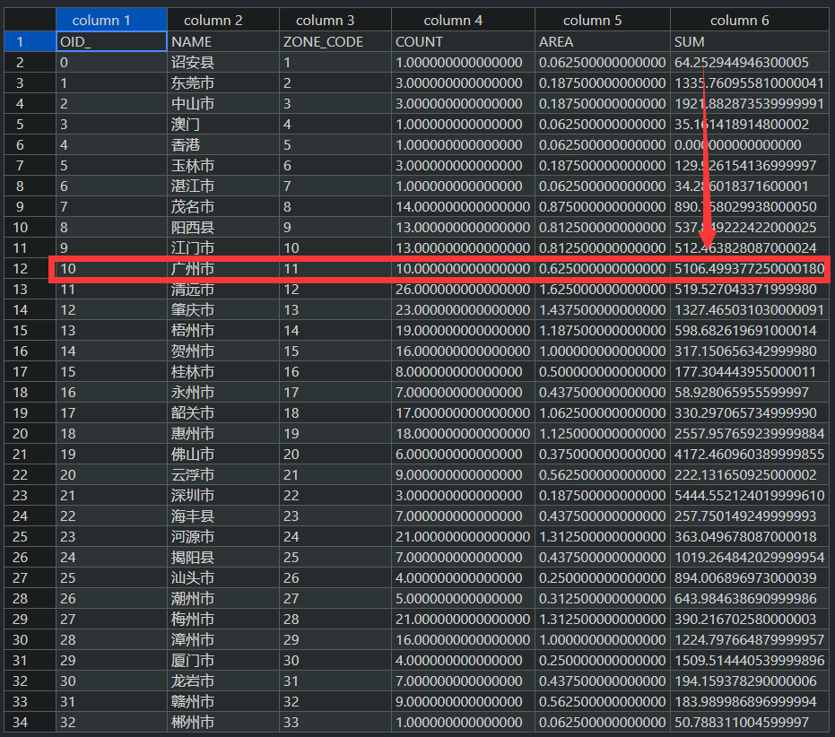

# 在MEIC清单中使用本地排放源

--------------------

作者：王浩帆

--------------------


在开始此教程以前，我们已经有了一份广州市的本地工业排放清单（表）。

| Pollutant Name | Total Amount (Mg) |
| -------------- | ----------------- |
| NOx            | 1000              |
| SO2            | 2000              |


## 步骤1：配置namelist.input

主要注意以下两点：

* 修改`big_grid_file`为：`big_grid_file = "shapefile/CN-City.shp"`
* 修改`create_source`为：`create_source = 0,`

```
&global
    griddesc_file = "input/GRIDDESC.PRD274x181"
    griddesc_name = "PRD274x181"
    big_grid_file = "shapefile/CN-City.shp"
    geotiff_dir = "H:/MEIC/GeoTiff-2017"
    inventory_label = "MEIC"
    inventory_year = "2017"
    sectors = 'transportation', 'residential', 'power', 'agriculture', 'industry'
    allocator = 'line', 'landscan-global-2017_nodata.tif', 'power.tif', 'agriculture.tif', 'industry.tif',
    allocator_type = "line", "raster", "raster", "raster", "raster"
    inventory_mechanism = "MEIC-CB05"
    target_mechanism = "CB06"
    start_date = "2020-07-01"
    end_date = "2020-07-02"
    cores = 4
 /

 &line
    line_files = "motorway.shp", "primary.shp", "residential.shp", "secondary.shp"
    line_factors = 0.435798, 0.326848, 0.081712, 0.155642,
 /

 &control
    create_grid = 1,
    grid_info = 1,
    create_factor = 1,
    coarse_emission = 1,
    create_source = 0,
 /
 ```

 ## 步骤2：运行`coarse_emission_2_fine_emission.py`

 在终端中输入命令：

 ```shell
python coarse_emission_2_fine_emission.py
 ```

## 步骤3：打开`output\zoning_statistics\MEIC_2017_07__industry__*`

1. 打开`output\zoning_statistics\MEIC_2017_07__industry__NOx.csv`，将箭头所值位置改为本地清单中的NOx排放量（1000）:




同理打开`output\zoning_statistics\MEIC_2017_07__industry__SO2.csv`，修改广州市的SO2排放量。

## 步骤4：重新配置namelist.input

* 只需要修改`&control`部分即可。

```
&global
    griddesc_file = "input/GRIDDESC.PRD274x181"
    griddesc_name = "PRD274x181"
    big_grid_file = "shapefile/CN-City.shp"
    geotiff_dir = "H:/MEIC/GeoTiff-2017"
    inventory_label = "MEIC"
    inventory_year = "2017"
    sectors = 'transportation', 'residential', 'power', 'agriculture', 'industry'
    allocator = 'line', 'landscan-global-2017_nodata.tif', 'power.tif', 'agriculture.tif', 'industry.tif',
    allocator_type = "line", "raster", "raster", "raster", "raster"
    inventory_mechanism = "MEIC-CB05"
    target_mechanism = "CB06"
    start_date = "2020-07-01"
    end_date = "2020-07-02"
    cores = 4
 /

 &line
    line_files = "motorway.shp", "primary.shp", "residential.shp", "secondary.shp"
    line_factors = 0.435798, 0.326848, 0.081712, 0.155642,
 /

 &control
    create_grid = 0,
    grid_info = 0,
    create_factor = 0,
    coarse_emission = 0,
    create_source = 1,
 /
 ```

 ## 步骤5：运行`coarse_emission_2_fine_emission.py`

 在终端中输入命令：

 ```shell
python coarse_emission_2_fine_emission.py
 ```

 ## 步骤6：运行`Create-CMAQ-Emission-File.py`

  在终端中输入命令：

 ```shell
python Create-CMAQ-Emission-File.py
 ```