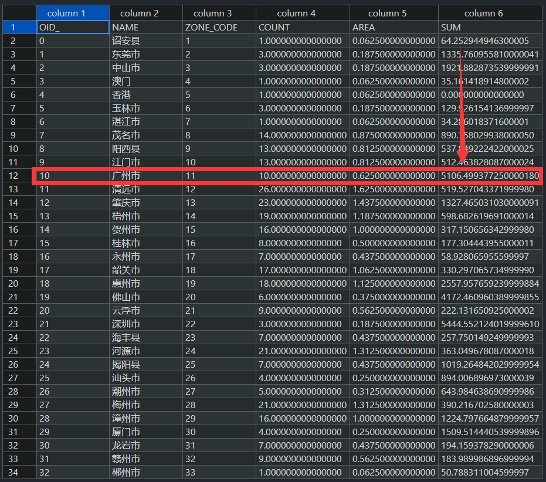

# Using local emission sources within the MEIC inventory.

--------------------

**Translator: Yuqi Zhu**

**Author: Haofan Wang**

--------------------


Prior to commencing this tutorial, we already possess a local industrial emission inventory (table) for the city of Guangzhou.

| Pollutant Name | Total Amount (Mg) |
| -------------- | ----------------- |
| NOx            | 1000              |
| SO2            | 2000              |


## Step 1: Configure the namelist.input file.

Two main points should be noted:

* Modify the `big_grid_file` parameter as follows: `big_grid_file = "shapefile/CN-City.shp"`
* Modify the `create_source` parameter as follows: `create_source = 0,`

```
&global
    griddesc_file = "input/GRIDDESC.PRD274x181"
    griddesc_name = "PRD274x181"
    big_grid_file = "shapefile/CN-City.shp"
    geotiff_dir = "H:/MEIC/GeoTiff-2017"
    inventory_label = "MEIC"
    inventory_year = "2017"
    sectors = 'transportation', 'residential', 'power', 'agriculture', 'industry'
    allocator = 'line', 'landscan-global-2017_nodata.tif', 'power.tif', 'agriculture.tif', 'industry.tif',
    allocator_type = "line", "raster", "raster", "raster", "raster"
    inventory_mechanism = "MEIC-CB05"
    target_mechanism = "CB06"
    start_date = "2020-07-01"
    end_date = "2020-07-02"
    cores = 4
 /

 &line
    line_files = "motorway.shp", "primary.shp", "residential.shp", "secondary.shp"
    line_factors = 0.435798, 0.326848, 0.081712, 0.155642,
 /

 &control
    create_grid = 1,
    grid_info = 1,
    create_factor = 1,
    coarse_emission = 1,
    create_source = 0,
 /
 ```

## Step 2: Run the `coarse_emission_2_fine_emission.py` script.

Enter the following command in the terminal:

 ```shell
python coarse_emission_2_fine_emission.py
 ```

## Step 3: Open the `output\zoning_statistics\MEIC_2017_07__industry__*` file.

1. Open the `output\zoning_statistics\MEIC_2017_07__industry__NOx.csv` file and replace the value at the arrow position with the NOx emissions (1000) from the local inventory:




Similarly, open the `output\zoning_statistics\MEIC_2017_07__industry__SO2.csv` file and modify the SO2 emissions for Guangzhou city.

## Step 4: Reconfigure the namelist.input file.

* Only the `&control` section needs to be modified.

```
&global
    griddesc_file = "input/GRIDDESC.PRD274x181"
    griddesc_name = "PRD274x181"
    big_grid_file = "shapefile/CN-City.shp"
    geotiff_dir = "H:/MEIC/GeoTiff-2017"
    inventory_label = "MEIC"
    inventory_year = "2017"
    sectors = 'transportation', 'residential', 'power', 'agriculture', 'industry'
    allocator = 'line', 'landscan-global-2017_nodata.tif', 'power.tif', 'agriculture.tif', 'industry.tif',
    allocator_type = "line", "raster", "raster", "raster", "raster"
    inventory_mechanism = "MEIC-CB05"
    target_mechanism = "CB06"
    start_date = "2020-07-01"
    end_date = "2020-07-02"
    cores = 4
 /

 &line
    line_files = "motorway.shp", "primary.shp", "residential.shp", "secondary.shp"
    line_factors = 0.435798, 0.326848, 0.081712, 0.155642,
 /

 &control
    create_grid = 0,
    grid_info = 0,
    create_factor = 0,
    coarse_emission = 0,
    create_source = 1,
 /
 ```

## Step 5: Run the `coarse_emission_2_fine_emission.py` script.

Enter the following command in the terminal:

 ```shell
python coarse_emission_2_fine_emission.py
 ```

## Step 6: Run the `Create-CMAQ-Emission-File.py` script.

Enter the following command in the terminal:

 ```shell
python Create-CMAQ-Emission-File.py
 ```