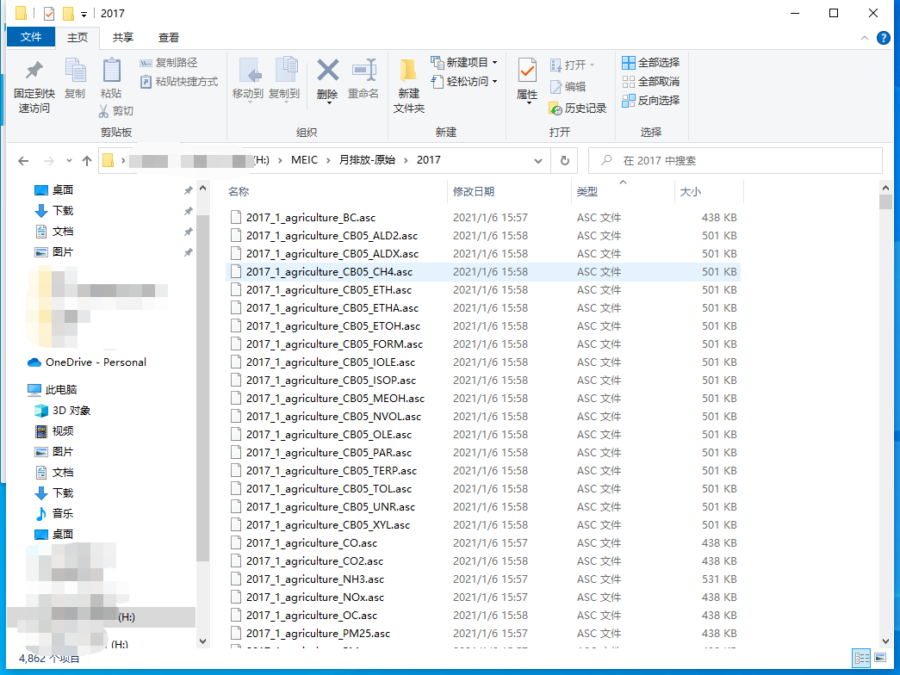
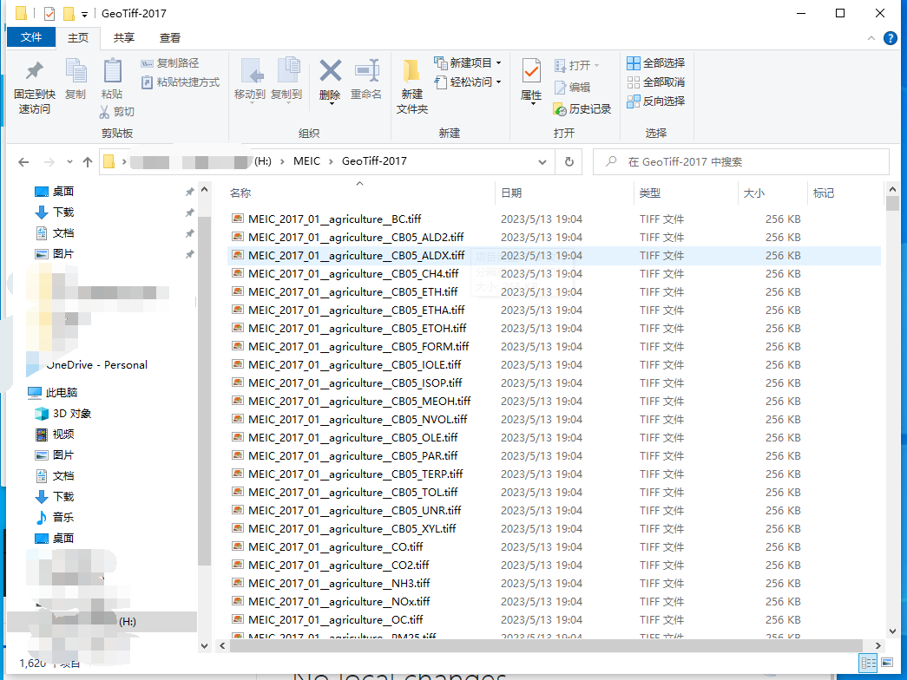
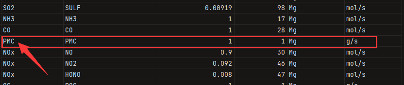
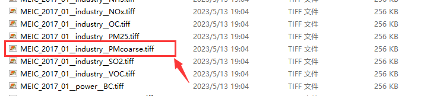

# 使用2017年的MEIC清单制作珠三角的排放文件

--------------------

**作者：王浩帆**

--------------------

本教程通过一个制作珠江三角洲模拟域（空间分辨率：3km）的排放清单来讲解以下两个程序的运行流程。
1. [coarse_emission_2_fine_emission.py](../coarse_emission_2_fine_emission.py)
2. [Create-CMAQ-Emission-File.py](../Create-CMAQ-Emission-File.py)

本教程使用的原始排放清单为2017年MEIC清单（逐月、分部门、CB05机制），输出的排放文件为2017年7月1日至2017年7月2日的分部门排放文件（CB06，AERO7机制）。

## 第一步：准备`GRIDDESC`文件

`GRIDDESC`由CMAQ的前处理系统MCIP输出，主要需要注意以下两点：
* 保证每一个`GRIDDESC`中有且仅有一个网格信息。
* 保证GRIDDESC中的网格投影为Lambert投影（只要你的WRF设置为Lambert并正常运行MCIP，基本都不会有错）。
* 如本教程所示的`GRIDDESC`文件中，`PRD274x181`是网格名称（`griddesc_name`: 此参数将会被`namelist.input`用到）。

```shell
' '
'LamCon_40N_97W'
  2        25.000        40.000       110.000       110.000        28.500
' '
'PRD274x181'
'LamCon_40N_97W'     48000.000   -902500.000      3000.000      3000.000 271 178   1
' '
```

## 第二步：准备MEIC排放清单

下载地址：http://meicmodel.org/

由于MEIC存在版权保护，因此本程序中不提供数据，请用户自行下载。

下载到的MEIC通常会提供包括`*.asc`在内的一种或几种格式（如图），但本程序所有的网格化文件，都要求使用WGS1984投影的GeoTIFF文件。



因此需要通过[MEIC转GEOTIFF工具](../PREP/meic_2_GeoTiff.py)来对MEIC进行转换。在此程序中，输入的文件仅为`*.asc`格式。

通过以下方法配置好代码以后，在终端中运行`python ./PREP/meic_2_GeoTiff.py`即可。
```python
# ------------------------------------------
input_dir = "MEIC的asc格式文件所在目录路径"
output_dir = "输出文件所在目录路径"
# ------------------------------------------
```

运行成功以后，将会在输出路径下看到系列GeoTIFF格式文件。



## 第三步：配置`namelist.input`文件。

准备好`GRIDDESC`文件和MEIC的GeoTIFF文件以后就可以开始配置`namelist.input`来准备运行程序了。

在配置`namelist.input`文件之前，需要强调一点：**整个程序对文件命名的要求都十分严格，请按要求给定GeoTIFF文件的命名**。

命名规则为： `{LABEL}_{YYYY}_{MM}__{SECTOR}__{POLLUTANT}.tiff`
* LABEL：可以自行指定，但不能包含`_`。
* YYYY：清单年份，4位字符串。
* MM：清单月份，2位字符串。
* SECTOR：部门名称，**注意：SECTOR的前后是两个`_`,而不是一个。**
* POLLUTANT：物种名称。

**注意：TIFF中的单位必须是`Mg/month`或者`Mmol/month`。**

以下是一个`namelist.input`的示例：

1. 网格和文件名信息。
* griddesc_file：`GRIDDESC`文件所在路径。
* griddesc_name：`GRIDDESC`文件中的网格名称。
* big_grid_file：粗网格的shapefile文件，该文件中必须含有`NAME`字段，类型为字符串类型，WGS1984投影。
* geotiff_dir：GeoTIFF文件所在目录路径。
* inventory_label：原始清单文件名中的`${LABEL}`。
* inventory_year：原始清单文件名中的`${YYYY}`。

2. 空间分配信息（以下参数保证一一对应）。
* sectors： 分配部门，部门为GeoTIFF文件名中所提到的`{SECTOR}`。
* allocator：分配因子，分配因子所在路径必须放在[allocator](../allocator)目录中，当对应的分配类型为`line`时，读取`&line`部分所设置的参数，此处分配因子任意填写。
* allocator_type：分配类型，支持`raster`分配和`line`分配。

*&line*部分
* line_files：存放于[allocator](../allocator)目录中线数据名称。
* line_factors：`line_files`中的线数据将按照此比例进行组合分配。

3. 物种分配谱信息。
* inventory_mechanism：字符串，配合`target_mechanism`使用，用于寻找对应的物种分配文件，不能含有`_`。
* target_mechanism：字符串，配合`inventory_mechanism`使用，用于寻找对应的物种分配文件，不能含有`_`。
**注意：物种分配谱文件存放于[species](../species)中，且物种分配文件的命名规则为：{inventory_mechanism}_{target_mechanism}_speciate_{SECTOR}**

4. 排放文件日期
* start_date：排放文件的开始日期，格式：YYYY-MM-DD
* end_date：排放文件的结束日期，格式：YYYY-MM-DD

5. 并行计算核心数
* cores：根据自己的电脑配置设置。

6. `&control`开关控制部分
* create_grid：控制生成模拟域网格shapefile。
* grid_info：控制生成网格信息表格。
* create_factor：控制生成排放因子文件。
* coarse_emission：控制粗网格的区域统计。
* create_source：控制生成source文件。

```Fortran
&global
    griddesc_file = "input/GRIDDESC.PRD274x181"
    griddesc_name = "PRD274x181"
    big_grid_file = "shapefile/MEIC-0P25.shp"
    geotiff_dir = "H:\MEIC\GeoTiff-2017"
    inventory_label = "MEIC"
    inventory_year = "2017"
    sectors = 'transportation', 'residential', 'power', 'agriculture', 'industry'
    allocator = 'line', 'population-nodata-0.tif', 'ave-nodata-0.tif', 'ave-nodata-0.tif', 'ave-nodata-0.tif',
    allocator_type = "line", "raster", "raster", "raster", "raster"
    inventory_mechanism = "MEIC-CB05"
    target_mechanism = "CB06"
    start_date = "2020-07-01"
    end_date = "2020-07-02"
    cores = 4
 /

 &line
    line_files = "motorway.shp", "primary.shp", "residential.shp", "secondary.shp"
    line_factors = 0.435798, 0.326848, 0.081712, 0.155642,
 /

 &control
    create_grid = 1,
    grid_info = 1,
    create_factor = 1,
    coarse_emission = 1,
    create_source = 1,
 /
```
配置好`namelist.input`以后进入第四步。

## 第四步：完成空间分配。

将[allocator](../allocator)目录下的压缩文件解压。

该过程通过[coarse_emission_2_fine_emission.py](../coarse_emission_2_fine_emission.py)实现，输入以下命令执行脚本。

```shell
python .\coarse_emission_2_fine_emission.py
```

## 第五步：完成时间分配和物种分配，并生成直接输入CMAQ的排放文件。

该过程通过[Create-CMAQ-Emission-File.py](../Create-CMAQ-Emission-File.py)实现，输入以下命令执行脚本。

```shell
python .\Create-CMAQ-Emission-File.py
```

虽然在[output](../output)中成功生成了排放文件，但是在日志中发现了如下警告信息。

```shell
Warning: Do not have the pollutant named PMC.
```

这是因为在对应部门的物种文件中第一列的`PMC`无法找到（如图）



根本原因是因为，GeoTIFF所在目录下的`PMC`物种的命名为`PMcoarse`.


**解决方案**
1. 将对应部门物种文件中第一列的`PMC`改为`PMcoarse`，重新运行第五步。
2. 使用[rename_original_inventory_(pollutant).py](../UTIL/rename_original_inventory/rename_original_inventory_(pollutant).py)将`PMcoarse`改为`PMC`即可。
修改`namelist.input`中的`geotiff_dir`为新的GeoTIFF目录，重新运行第四步和第五步即可。

[rename_original_inventory_(pollutant).py](../UTIL/rename_original_inventory/rename_original_inventory_(pollutant).py)使用方法见[原始排放清单重命名使用手册](../UTIL/rename_original_inventory/README.md)。


