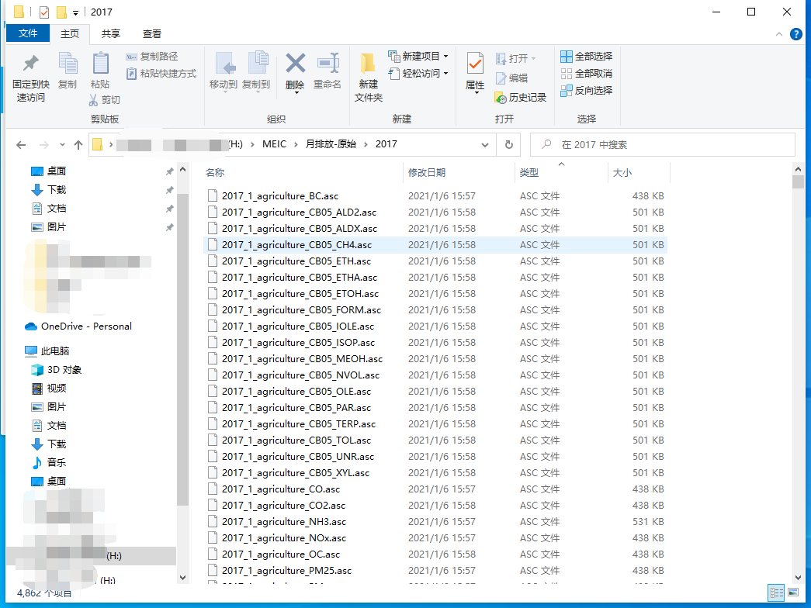
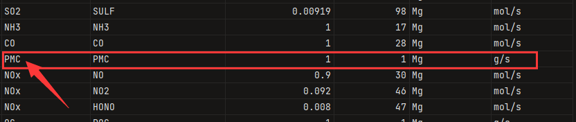

# Create emission files for PRD using MEIC 2017

------------------------

**Translator: Yifei Xu**

**Author: Haofan Wang**

------------------------

This tutorial explains the flow of the following two programs by means of creating an emission inventory for a simulated domain of the Pearl River Delta (spatial resolution: 3km).

1. [coarse_emission_2_fine_emission.py](../coarse_emission_2_fine_emission.py)
2. [Create-CMAQ-Emission-File.py](../Create-CMAQ-Emission-File.py)

The original emission inventory used in this tutorial is the MEIC inventory by the year of 2017 (month-by-month, subsectors, CB05 mechanism). The output emission file is the subsectors-emission file for July 1, 2017 to July 2, 2017 (CB06, AERO7 mechanism).

## Step 1：prepare `GRIDDESC` file

`GRIDDESC` is output by MCIP, CMAQ's pre-processing system. 2 main points need to be noted:
* Ensure that there is only one grid message in each `GRIDDESC`.
* Make sure that the grid projection specified in GRIDDESC is set to Lambert projection (as long as your WRF model is set to Lambert and you have run MCIP properly, there should be basically nothing wrong with it).
* In the `GRIDDESC` file as shown in this tutorial, `PRD274x181` is the grid name (`griddesc_name`: this parameter will be used by `namelist.input`)


```shell
' '
'LamCon_40N_97W'
  2        25.000        40.000       110.000       110.000        28.500
' '
'PRD274x181'
'LamCon_40N_97W'     48000.000   -902500.000      3000.000      3000.000 271 178   1
' '
```

## Step 2: Preparation of MEIC emission inventories

Downoad website: http://meicmodel.org/

Since copyright protection exists for MEIC, the data is not provided in this program and users should download it themselves.

The downloaded MEIC is usually provided in one or several formats including `*.asc` (as shown), but all the gridding files in this program require the use of WGS1984 projected GeoTIFF files.



Therefore it is necessary to convert MEIC by [MEIC to GEOTIFF tool](../PREP/meic_2_GeoTiff.py). In this program, the input files only need to be in `*.asc` format.

After configured the code by the following pattern, it is time to run `python . /PREP/meic_2_GeoTiff.py`.
```python
# ------------------------------------------
input_dir = "Path to the directory where MEIC's asc format files are located"
output_dir = "Path to the directory where the output file is located"
# ------------------------------------------
```

After running successfully, you will see the series of GeoTIFF format files under the output path.


## Step 3: Configure the `namelist.input` file

After preparing the `GRIDDESC` file and the MEIC GeoTIFF file, you can start to configure the `namelist.input` to prepare the program for running.

Before configuring the `namelist.input` file, one point needs to be emphasized: **The entire program is very strict about file naming, so please give the GeoTIFF file names as required**.

The naming rules are： `{LABEL}_{YYYY}_{MM}__{SECTOR}__{POLLUTANT}.tiff`
* LABEL：Users can specify it themselves, but it cannot contain `_`.
* YYYY：The year of the inventory，a 4-bit string.
* MM：The month of the inventory, a 2-bit string.
* SECTOR：The name of sectors, **Note: SECTOR is preceded and followed by two `_`s, not one.**
* POLLUTANT：The name of species。

**Note: The unit in TIFF must be `Mg/month` or `Mmol/month`.**

The following is an example of a `namelist.input`:

1. Grid and file name information.
* griddesc_file: The path where the `GRIDDESC` file is located.
* griddesc_name: The name of the grid in the `GRIDDESC` file.
* big_grid_file: The shapefile of the coarse grid, which must contain the `NAME` field, of type string type, WGS1984 projection.
* geotiff_dir: The path where the GeoTIFF files are located.
* inventory_label: `${LABEL}` in the original inventory file name.
* inventory_year: `${YYYY}` in the original inventory file name.

2. Space allocation information (the following parameters ensure one-to-one correspondence).
* sectors: The `{SECTOR}` mentioned in the GeoTIFF file name.
* allocator: Allocation factor, the path where the allocation factor is located must be placed in the [allocator](../allocator) directory. When the corresponding allocation type is `line`, the program will read the parameters set in the `&line` section, and users could fill in the allocation factor arbitrarily here.
* allocator_type: Allocation types. Both `raster` allocation and `line` allocation are supported.

*&line* section
* line_files: The name of the line data stored in the [allocator](../allocator).
* line_factors: The line data in `line_files` will be allocated in this ratio for the combination.

3. Species allocation spectrum information.
* inventory_mechanism: String that should not contain `_`. Used with `target_mechanism` to find the corresponding species allocation file.
* target_mechanism: String that should not contain `_`. Used with `inventory_mechanism` to find the corresponding species allocation file.
**Note: The species allocation spectrum files are stored in [species](../species) and the naming convention for them is {inventory_mechanism}_{target_mechanism}_speciate_{SECTOR}**

4. Date of the emission files
* start_date: Start date of the file with a format of 'YYYY-MM-DD'.
* end_date：End date of the file with a format of 'YYYY-MM-DD'.

5. Number of parallel computing cores
* cores: Users could set it according to their devices.

6. `&control` switch section
* create_grid: Generate the simulation domain grid shapefile.
* grid_info: Generate grid information forms.
* create_factor: Generate emission factors document.
* coarse_emission: Area statistics for coarse grids.
* create_source: Generate source file。

```Fortran
&global
    griddesc_file = "input/GRIDDESC.PRD274x181"
    griddesc_name = "PRD274x181"
    big_grid_file = "shapefile/MEIC-0P25.shp"
    geotiff_dir = "H:\MEIC\GeoTiff-2017"
    inventory_label = "MEIC"
    inventory_year = "2017"
    sectors = 'transportation', 'residential', 'power', 'agriculture', 'industry'
    allocator = 'line', 'population-nodata-0.tif', 'ave-nodata-0.tif', 'ave-nodata-0.tif', 'ave-nodata-0.tif',
    allocator_type = "line", "raster", "raster", "raster", "raster"
    inventory_mechanism = "MEIC-CB05"
    target_mechanism = "CB06"
    start_date = "2020-07-01"
    end_date = "2020-07-02"
    cores = 4
 /

 &line
    line_files = "motorway.shp", "primary.shp", "residential.shp", "secondary.shp"
    line_factors = 0.435798, 0.326848, 0.081712, 0.155642,
 /

 &control
    create_grid = 1,
    grid_info = 1,
    create_factor = 1,
    coarse_emission = 1,
    create_source = 1,
 /
```
After configured `namelist.input`, users now could go to step 4.

## Step 4: Complete the space allocation.

Extract the zip file from the [allocator](../allocator) directory.

The process is implemented via [coarse_emission_2_fine_emission.py](../coarse_emission_2_fine_emission.py), enter the following command to execute the script.

```shell
python .\coarse_emission_2_fine_emission.py
```

## Step 5: Complete the time and species allocation, generate the emission files for direct input into CMAQ.

The process is implemented via [Create-CMAQ-Emission-File.py](../Create-CMAQ-Emission-File.py), enter the following command to execute the script.

```shell
python .\Create-CMAQ-Emission-File.py
```
Although the emission files were successfully generated in [output](../output), the following warning message was found in the log.

```shell
Warning: Do not have the pollutant named PMC.
```

This is because `PMC` cannot be found in the first column of the species file of the corresponding sector (as shown in the picture).



The root cause is that the `PMC` in the GeoTIFF directory is named as `PMcoarse`.


**Solutions**
1. Change `PMC` to `PMcoarse` in the first column of the corresponding sector species file and re-run step 5.
2. Change `PMcoarse` to `PMC` using [rename_original_inventory_(pollutant).py](../UTIL/rename_original_inventory/rename_original_inventory_(pollutant).py).
Modify `geotiff_dir` in `namelist.input` to the new GeoTIFF directory, and re-run steps 4 and 5.

The instruction of [rename_original_inventory_(pollutant).py](../UTIL/rename_original_inventory/rename_original_inventory_(pollutant).py) see [User Manual](../UTIL/rename_original_inventory/README.md).
