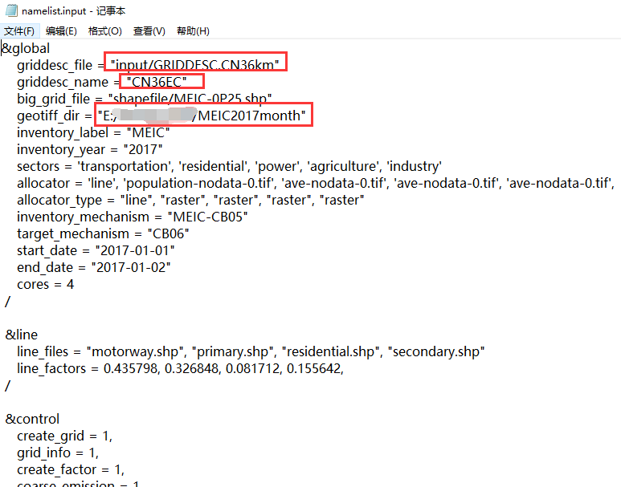
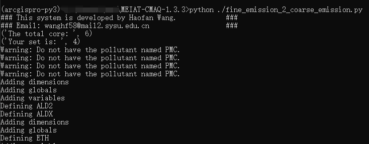
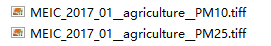
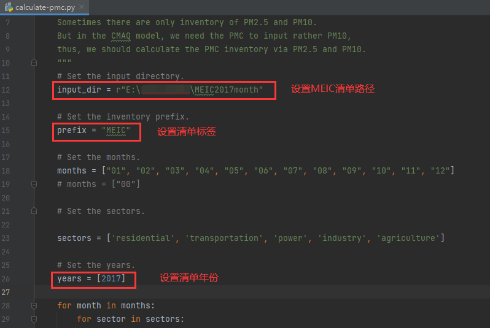
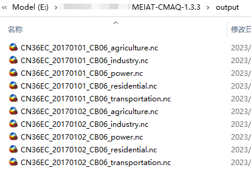

# 7.原始清单分辨率如果小于模拟域网格分辨率应该如何处理？

**作者：邱嘉馨**

1.首先，修改namelist.input，设置好网格信息文件GRIDDESC以及网格名等变量，以及时间分配系数文件和物种分配系数文件等，具体可参考步骤一。

2.打开终端，运行将精细化清单处理到粗网格程序python ./fine_emission_2_coarse_emission.py

如上图所示，提示找不到PMC，检查清单文件发现只有PM25和PM10，使用程序calculate-pmc.py计算生成PMC文件即可解决。

3.重新运行步骤2 ，出现如下界面即运行结束。在output文件夹下生成清单文件。

