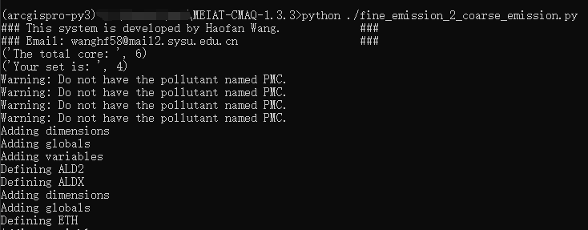
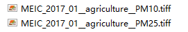
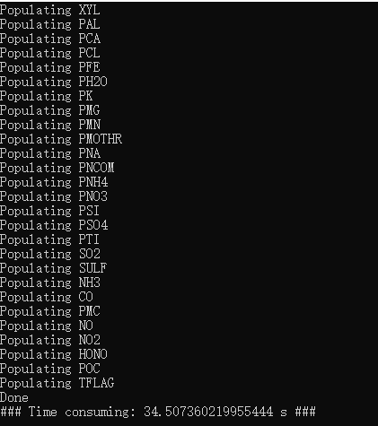
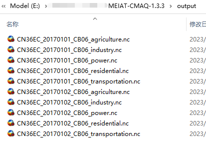

# 7. How to treat fine-resolution emission inventory with a targeted coarse grid?

------------------------

**Translator: Yifei Xu**

**Author: Jiaxin Qiu**

------------------------

1. First, modify `namelist.input`, set up the grid information file `GRIDDESC` and variables such as grid name, as well as the time allocation coefficient file and the species allocation coefficient file, etc., as described in Step 1.


2. Execute the script in a terminal
```shell
python .\fine_emission_2_coarse_emission.py
```



If you receive warnings indicating that the PMC cannot be found as shown above, check the inventory file and find only PM25 and PM10. Use the program `calculate-pmc.py` to generate the PMC file.




3. Re-run step 2 and the following screen will appear to end the run. The list file is generated in the output folder.



