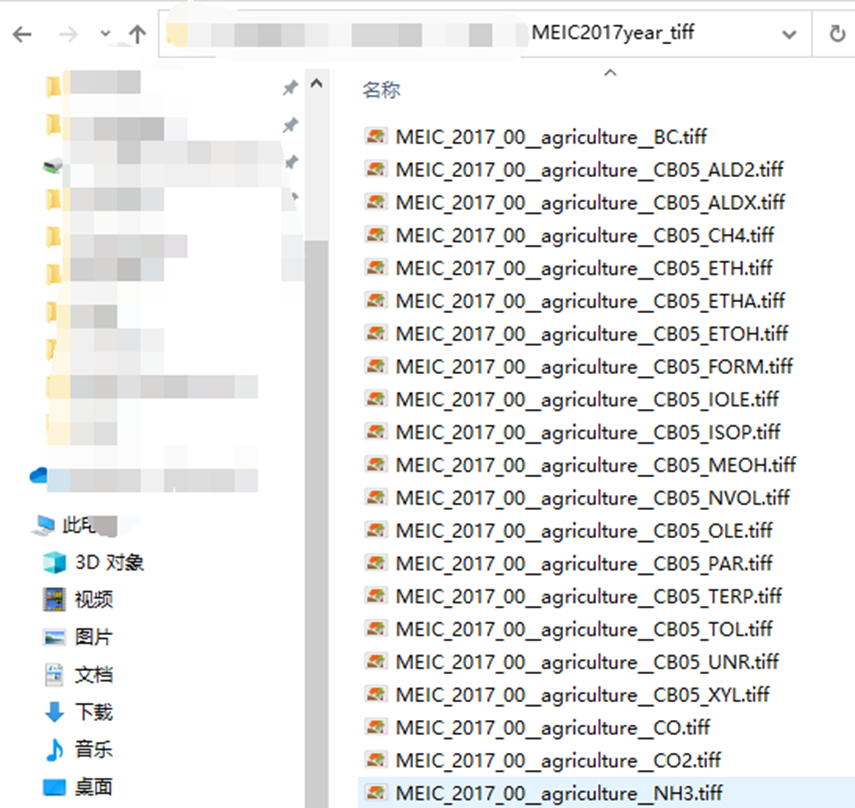
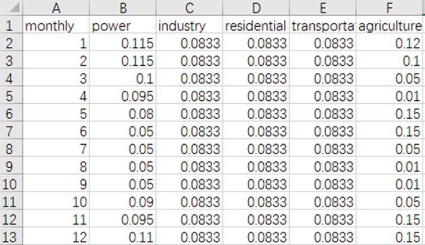
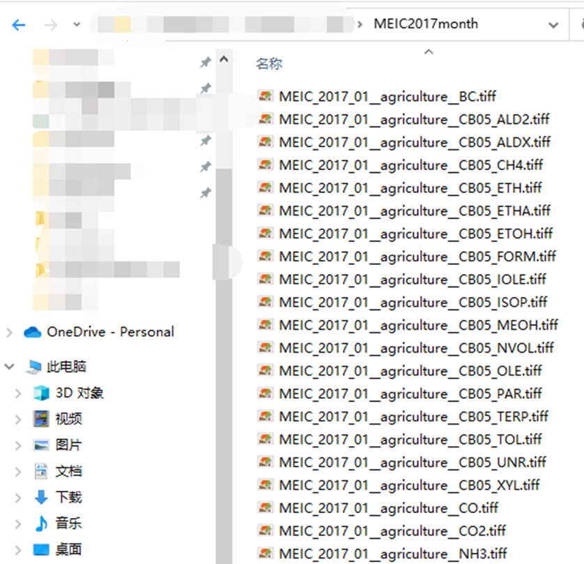

# 如何处理只有年总量的排放清单？

------------------------

**作者：邱嘉馨**

------------------------

本教程讲解如何使用年总量的排放清单。

1. 首先，使用[year2month.py](../year2month.py)将meic年清单的asc格式转为tiff（注意检查输出文件名的格式，部门之间是两个下划线）。

```python
input_dir = r"MEIC清单asc格式文件存放位置"
output_dir = r"MEIC清单tiff格式文件的输出位置"
```
配置好代码以后，在终端中输入命令：

```shell
python ./PREP/meic_2_GeoTiff.py
```

运行成功以后将会在输出路径下看到GeoTiff格式文件，如图所示：


2. 使用[year2month.py](../year2month.py)将年清单转换为月清单。

设置文件读取和输出路径：

```python
input_dir = r"年清单的tiff格式文件的存放路径"
output_dir = r"月清单的输出路径"
```

设置月分配系数：

月时间分配系数文件为[monthly.csv](../temporal/monthly.csv)，可以通过修改此文件设置不同部门的
月分配系数，注意列标题和清单文件名中的部门拼写保持一致。



如上配置好代码和时间分配系数表以后，在终端中输入以下命令并运行即可。

```shell
python ./year2month.py
```

运行成功以后，将会在输出路径下看到以下逐月的清单文件：


3. 后续步骤见表1。