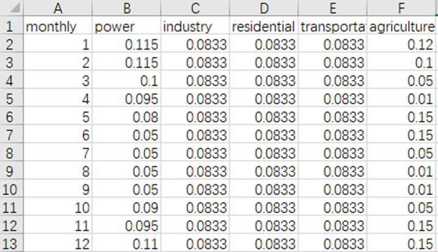

# How to handle emission inventories that only provide annual total emissions?

---------------------

**Translator: Ao Shen**

**Author：Jiaxin Qiu**

---------------------

This tutorial explains how to use emission inventories with annual total emissions.

1. First, use [year2month.py](../year2month.py) to convert the MEIC annual inventory in asc format to tiff (please ensure to check the format of the output file name, with double underscores between departments).

```python
input_dir = r"path/to/meic/asc/files"
output_dir = r"path/to/tiff/files"
```
After configuring the code, enter the following command in the terminal:

```shell
python ./PREP/meic_2_GeoTiff.py
```

After successful execution, you will see the GeoTiff format files in the output path, as shown in the image.


2. Use [year2month.py](../year2month.py) to convert the annual inventory to monthly inventory.

Set the file input and output paths：

```python
input_dir = r"path/to/annual/emission/files"
output_dir = r"path/to/monthly/emission/files"
```

Set the monthly distribution coefficient：

The monthly temporal allocation coefficient file is [monthly.csv](../temporal/monthly.csv). We can modify this file to set different monthly allocation coefficients for different departments. Please ensure that the column headers match the department spelling in the inventory file names.



After configuring the code and temporal allocation coefficient table, enter the following command in the terminal:

```shell
python ./year2month.py
```

After successful execution, the following monthly inventory files will be seen in the output path：


3. The following steps are shown in Table 1.